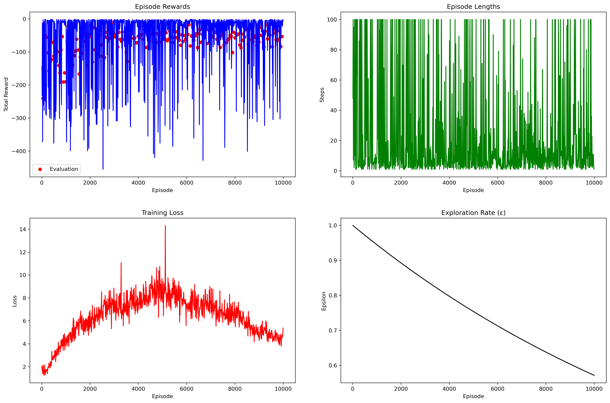

Ideas for fixing this 

1. Choose an easier problem lol

2. get rid of pooling. i think that might be rlly bad lol.

3. attention?

4. simpler state representation -- eg instead of feeding in the
   whole grid just feed in a little patch surrounding the
   character  -- oh that's kind of nice actually  and then i dont
   need to buy a gpu lol

5. let the agent remember its path.
for instance, the input could include the last couple places
where the guy has been or something

6. "ciriculum learning" -- start with easy mazes, work up to
   harder ones.
   this could look like having mazes which are mostly empty to
   start with :)


7. reward exploration for reals -- keep track of recently visited
   states, reward visiting new ones

---

oh dear. 
I think I made my reward hackable.
going back and forth gets infinite reward. sigh.
i hope we never do that irl

---

oh apparently a pretty principled way to do reward shaping is 
by adding $\gamma*\phi(S_{t+1}) - \phi(S_t)$.
Like this does not change $\argmax_\theta \E_{\tau\sim \pi_\theta} \sum_{t=0}^{T} \gamma^{t}r_t$ 
if the start and ending states are fixed.


---

```bash
# good gpu:
git clone https://github.com/awestover/FDT; cd FDT; python main.py

# cheap gpu: 
git clone https://github.com/awestover/FDT; cd FDT; pip install torch; pip install numpy; python main.py
```


----

plan: 
1. try ciriculum learning
2. why is it so slow?
3. give up on this project :'(


```python
import cProfile
cProfile.run('main()', 'training_stats')

import pstats
p = pstats.Stats('training_stats')
p.sort_stats('cumulative').print_stats(30)
```
wow this code was useful!


----


## update

- It's kind of working now!
- I think the ciriculum learning thing was super **key**.

- I'm somewhat interested in trying 
  - slightly harder mazes
  - limiting the visual field of the agent and then using a much smaller network 
    - (probably just an MLP at that point, not a CNN)

- Note: if it ends up being too slow and profile shows that generating mazes is a bottleneck, we can try generating them in batches

- But I'll note that this setting seems like it was probably too complex to get the FDT thing working


----

plan now:

1. try trainig the big network on tricky mazes 
(if it looks slow, can spend a sec on optimizing it)

2. then we should probably call it a day on this guy


---

ok, I'm totally going down the optimization rabbit hole. 
I want RL to *make sense*
I want to *feel* what the hyperparameters should be, how credit
assignment should work. 
Most of all, I want the agent to be perfect.

I want it to actually try to get to the end of the maze

Here are some computations.

---

An L4 GPU can do 30 teraFLOPS if we are talking about fp32's.
I don't get paid enough to mess around with fp16's (actually I
don't get paid at all! except in the joy of seeing my little AI
dude solve some mazes).

Let's call this 10^13 TFs just in case my GPU is not an L4 or if
I do some dumb stuff.

My CNN for a 16x16 grid has 10k params.
Crap CNNs are parameter efficient!
This makes me feel not bad about feeding in the whole image.

I'm going to have 
BSZ = 1024
MAX_EP_LENGTH = 100

I'm going to run BSZ many parallel instances of letting the AI
explore a maze.
After that I'm going to update the policy network based on all
those experiences.

10 times during that process, I'll update the target net

Finally, I'll iterate this whole thing for 10^6 episodes

Which should take about 2 minutes.

---

Asking Claude to write 600 line diffs is not a good idea it turns out. 
If I could figure out how to get Claude to iterate, test whether
its code compiles, and then fix it when it doesnt compile, then
it'd be fine. But as is you should ask for much smaller diffs
when doing complicated things.

But I think it's working now.


----

i wish i were using priority replay buffer. 

but the plan for now is --- cache mazes, 
then just let it run and hope it learns

----

BSZ 1024
MAX_EP_LENGTH 100
NUM_EPISODES 10^5

10^(3 + 2 + 5) = 10^10

---

oh dear there is a serious bug
plan: 
- fix this bug
- let it run while i get lunch
- move on from this project: it has zero AIS value and I've
    already gained the educational benefits

----

another bug --- the maze cache thing doesnt actually let you
choose different difficulty levels
maybe not a huge deal since the mazes are super easy tho


---

ideas for making stuff better:

- priority replay buffer
- fix the maze difficulty bug so i can have a more interesting ciriculum

----

note: if loss is increasing this is really really bad.
this is called exploding gradients. 
and it probably means 
- lr too high?
- grad clipping not good enough
- idk
keep an eye on this metric.

if your loss is getting better and you are frequently updating
target net, then you will win

---

MLP is doing much better than the CNN was

I'm concerned that it might be overfitting 
idk


--- 

another thought: 
part of the problem might be that the agent doesn't have memory 
so deterministic strategies can get stuck very easily.

probbaly should have given the agent memory

